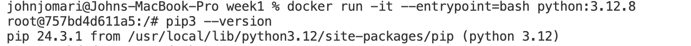

```
span
```

# HOMEWORK 1

# Question 1. Understanding docker first run

What's the version of `pip` in the image?

- 24.3.1
  Solution:
- 

## Question 2. Understanding Docker networking and docker-compose

Given the following `docker-compose.yaml`, what is the `hostname` and `port` that **pgadmin** should use to connect to the postgres database?

db:5432

## Question 3. Trip Segmentation Count

During the period of October 1st 2019 (inclusive) and November 1st 2019 (exclusive), how many trips, **respectively**, happened:

1. Up to 1 mile
2. In between 1 (exclusive) and 3 miles (inclusive),
3. In between 3 (exclusive) and 7 miles (inclusive),
4. In between 7 (exclusive) and 10 miles (inclusive),
5. Over 10 miles

Answers:

104,802; 198,924; 109,603; 27,678; 35,189

```sql

select count(*)
from green_tripdata_2019
where date(lpep_pickup_datetime) >= '2019-10-01'
and date(lpep_dropoff_datetime) < '2019-11-01'
and trip_distance > 10
and trip_distance <= 3
```

## Question 4. Longest trip for each day

Which was the pick up day with the longest trip distance?
Use the pick up time for your calculations.

- 2019-10-31

```sql

with cte1 as (
select max(trip_distance) as trip , date(lpep_pickup_datetime) as lpep_pickup_datetime
from green_tripdata_2019
group by date(lpep_pickup_datetime), date(lpep_dropoff_datetime))SELECT lpep_pickup_datetime, trip
FROM cte1
WHERE trip = (
SELECT MAX(trip) FROM cte1
)
```

## Question 5. Three biggest pickup zones

Which were the top pickup locations with over 13,000 in
`total_amount` (across all trips) for 2019-10-18?

Consider only `lpep_pickup_datetime` when filtering by date.

- East Harlem North, East Harlem South, Morningside Heights

```pgsql
with cte1 as (
SELECT date(g.lpep_pickup_datetime), g."PULocationID", z."Zone",g."trip_distance", g."total_amount"
FROM green_tripdata_2019 as g
INNER JOIN zone as z
on z."LocationID" = g."PULocationID"
WHERE date(g.lpep_pickup_datetime) = '2019-10-18' and
z."Zone" in ('East Harlem North', 'East Harlem South', 'Morningside Heights'))
,
cte2 as (
SELECT date(g.lpep_pickup_datetime), g."PULocationID", z."Zone",g."trip_distance", g."total_amount"
FROM green_tripdata_2019 as g
INNER JOIN zone as z
on z."LocationID" = g."PULocationID"
WHERE date(g.lpep_pickup_datetime) = '2019-10-18' and
z."Zone" in ('East Harlem North', 'Morningside Heights')),cte3 as (
SELECT date(g.lpep_pickup_datetime), g."PULocationID", z."Zone",g."trip_distance", g."total_amount"
FROM green_tripdata_2019 as g
INNER JOIN zone as z
on z."LocationID" = g."PULocationID"
WHERE date(g.lpep_pickup_datetime) = '2019-10-18' and
z."Zone" in ('Astoria Park', 'Morningside Heights', 'East Harlem South')),cte4 as (
SELECT date(g.lpep_pickup_datetime), g."PULocationID", z."Zone",g."trip_distance", g."total_amount"
FROM green_tripdata_2019 as g
INNER JOIN zone as z
on z."LocationID" = g."PULocationID"
WHERE date(g.lpep_pickup_datetime) = '2019-10-18' and
z."Zone" in ('Astoria Park', 'Bedford', 'East Harlem North'))select sum(cte1.total_amount) , 1
from cte1
union
select sum(cte2.total_amount) , 2
from cte2
union
select sum(cte3.total_amount) , 3
from cte3
union
select sum(cte4.total_amount) , 4
from cte4
```

## Question 6. Largest tip

For the passengers picked up in October 2019 in the zone
named "East Harlem North" which was the drop off zone that had
the largest tip?

- JFK Airport

```sql
SELECT g."lpep_pickup_datetime" , z1."Zone", g."lpep_dropoff_datetime", z2."Zone", g."tip_amount"
FROM green_tripdata_2019 AS g
INNER JOIN zone AS z1
ON z1."LocationID" = g."PULocationID"
INNER JOIN zone AS z2
ON z2."LocationID" = g."DOLocationID"
where DATE(lpep_pickup_datetime) BETWEEN '2019-10-01' AND '2019-10-31'
AND z1."Zone" = 'East Harlem North'ORDER BY g."tip_amount" DESC
```

## Terraform

## Question 7. Terraform Workflow

Which of the following sequences, **respectively**, describes the workflow for:

1. Downloading the provider plugins and setting up backend,
2. Generating proposed changes and auto-executing the plan
3. Remove all resources managed by terraform`

Answers:

- terraform init, terraform apply -auto-approve, terraform destroy
