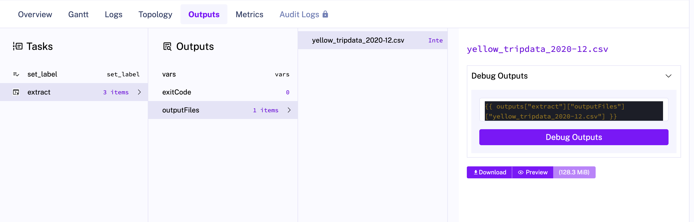
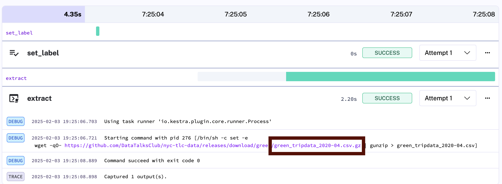
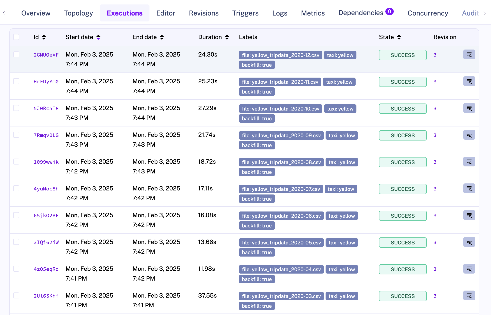
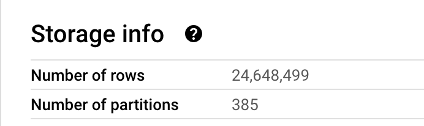
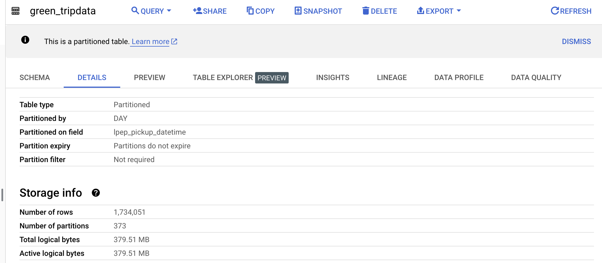
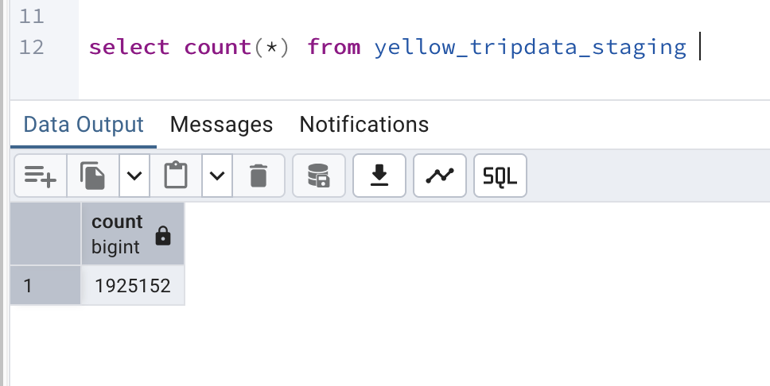

1. Within the execution for `Yellow` Taxi data for the year `2020` and month `12`: what is the uncompressed file size (i.e. the output file `yellow_tripdata_2020-12.csv` of the `extract` task)?

- 128.3 MB

2. What is the rendered value of the variable `file` when the inputs `taxi` is set to `green`, `year` is set to `2020`, and `month` is set to `04` during execution?

- `green_tripdata_2020-04.csv`
- 

How many rows are there for the `Yellow` Taxi data for all CSV files in the year 2020?

24,648,499

4. How many rows are there for the `Green` Taxi data for all CSV files in the year 2020?

- 1,734,051

How many rows are there for the `Yellow` Taxi data for the March 2021 CSV file?

- 1,925,152

6. How would you configure the timezone to New York in a Schedule trigger?

* Add a `timezone` property set to `America/New_York` in the `Schedule` trigger configuration
