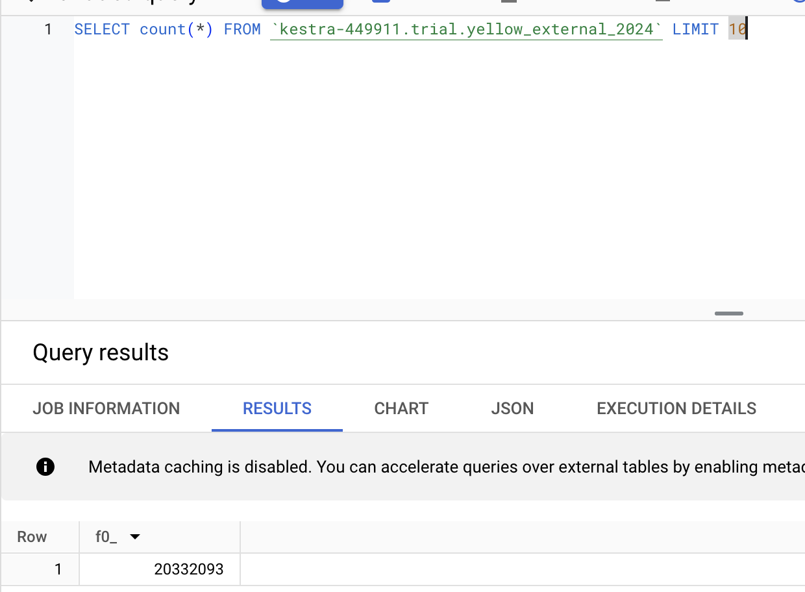
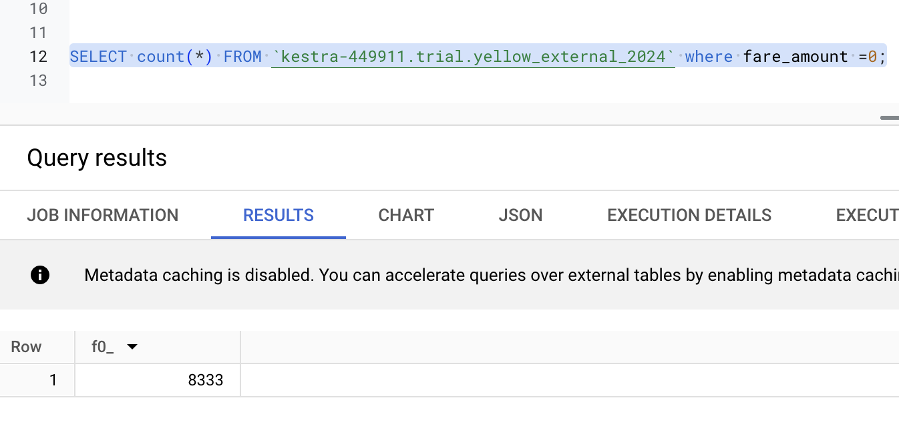

```

```


Question 1: What is count of records for the 2024 Yellow Taxi Data?

* 20,332,093
* 




Question 2: Write a query to count the distinct number of PULocationIDs for the entire dataset on both the tables.

What is the **estimated amount** of data that will be read when this query is executed on the External Table and the Table?

* 18.82 MB for the External Table and 47.60 MB for the Materialized Table
* 0 MB for the External Table and 155.12 MB for the Materialized Table
* 2.14 GB for the External Table and 0MB for the Materialized Table
* 0 MB for the External Table and 0MB for the Materialized Table


Question 4: How many records have a fare_amount of 0?

* 8,333





## Question 5:

What is the best strategy to make an optimized table in Big Query if your
query will always filter based on tpep_dropoff_datetime and order the
results by VendorID (Create a new table with this strategy)

* Partition by tpep_dropoff_datetime and Cluster on VendorID
* Partitioning by tpep_dropoff_datetime, since the queries always filter by tpep_dropoff_datetime, partitioning is crucial.  Cluster with VendorID. This makes the sorting operation much faster because BigQuery doesn't have to rearrange data across the entire table.


## Question 7:

Where is the data stored in the External Table you created?

* GCP Bucket
* GCP Bucket because the External Table is referencing Parquet files in Google Cloud Storage (GCS), the actual data remains in Cloud Storage


## Question 8:

It is best practice in Big Query to always cluster your data:

* False
* Not best for small tables, frequent full-table scans and it has a cost.


## Question 9:

[](https://github.com/DataTalksClub/data-engineering-zoomcamp/blob/main/cohorts/2025/03-data-warehouse/homework.md#bonus-not-worth-points-question-9)No Points: Write a `SELECT count(*)` query FROM the materialized table you created. How many bytes does it estimate will be read? Why?


